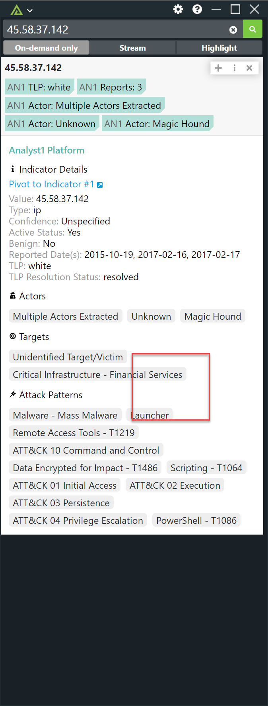
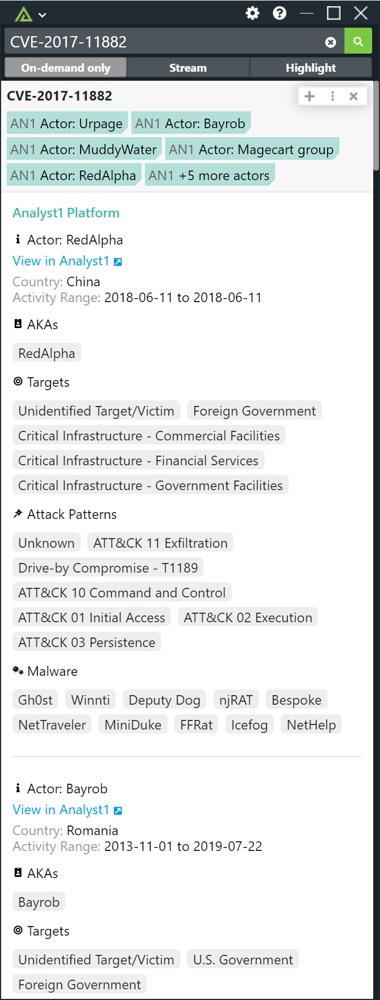
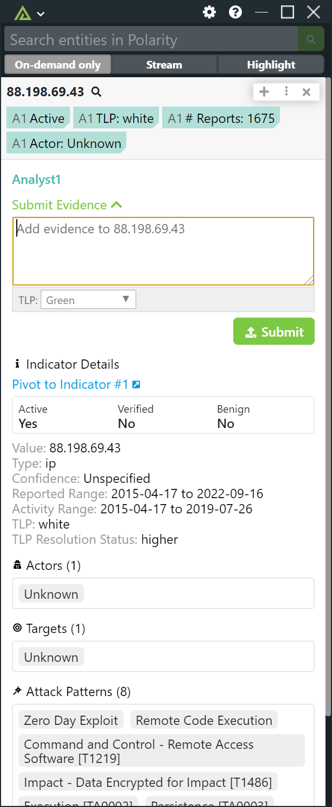

# Polarity Analyst1 Integration

The Polarity <> Analyst1 integration allows Polarity to get quick identification of Indicators and CVEs associated to Actors, Malware, and MITRE ATT&CK from the Analyst1 platform. Analyst1 maintains a comprehensive threat intelligence archive from free, paid, and internal sources powered by NLP automation and analyst curation. Analyst1 provides total data provenance in control by the customer, greatly increasing the simplicity of access and depth of data available for Polarity’s augmented views to end users.

|  |  |  |
|---|--|--|
|*Analyst1 Indicator results* | *Analyst1 CVE results* | *Analyst1 Evidence Submission* |

## Submitting Evidence

The Polarity Analyst1 integration supports adding evidence to an indicator.  To enable this capability, check the "Enable Evidence Submission" option.

When submitting evidence to Analyst1, the integration will create a txt file containing the content provided by the user.  The txt file will be named `polarity-<timestamp>.txt`.  Analyst1 automatically parses indicators from any evidence files and links the evidence file to the contained indicators.  The Polarity integration will automatically include the indicator when generating the evidence file.  Evidence files have the following format:

```
Evidence for {{indicator}}
Source: Polarity

{{user-provided-evidence-content}}
```

There can be a significant delay between an evidence file being uploaded and the file being processed by Analyst1.  After the evidence file is uploaded by the Polarity integration, the integration will poll the status of the evidence file for up to 60 seconds.  If the file has not completed processing the integration will stop polling.  At this point you will need to check Analyst1 directly for the file.

If the evidence file is processed within the 60 second window then a direct link to the evidence file will be provided within the integration.  

When submitting evidence you can modify the TLP.  The source for the evidence is set based on the value of the "Evidence Source Id" option.  Classification markings can be included in the evidence content specified by the user and Analyst1 will parse and use those markings.  

## Analyst1 Integration Options

### Analyst1 API URL

The base URL for the Analyst1 API to include the schema (https://) and port as needed

### Email Address

Valid Analyst1 Email Address

### Password

Valid Analyst1 Password

### Verified Indicators Only

If checked, the integration will only return verified indicators.  If this option is a per-user setting, the integration cache should be set to a "Per User Cache" to ensure each user only receives indicators that match their setting.  If this option is shared across users, the cache does not need to be per user.

### Enable Evidence Submission

If checked, the integration will allow users to submit text based evidence directly from the Overlay Window.

### Default Evidence TLP

The default TLP level for submitted evidence.

### Evidence Source Id

The numeric source identifier to be associated with submitted evidence. We recommend creating a Polarity specific source under "Admin Controls" -> "Manage Sources".

## Installation Instructions

Installation instructions for integrations are provided on the [PolarityIO GitHub Page](https://polarityio.github.io/).

## Polarity

Polarity is a memory-augmentation platform that improves and accelerates analyst decision making.  For more information about the Polarity platform please see:

https://polarity.io/
